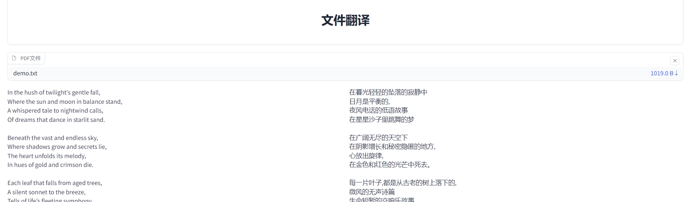

# file-translator
利用AI大模型或者api翻译文件，支持中英文翻译，支持pdf、docx、txt、html。

# 翻译模型
默认采用阿里千问Qwen1.5-14B-Chat-GPTQ-Int4模型.可以在lib/fanyi_qianwen.py更改模型。

# 安装方法

环境依赖

py310+pytorch 

https://pytorch.org/get-started/locally/ 

git clone https://github.com/lrjxgl/file-translator.git

cd file-translator

pip install -r requirements.txt

# 运行方法

python gradio_app.py

# 资料参考

pdf翻译参考 https://github.com/SUSTYuxiao/PdfTranslator

